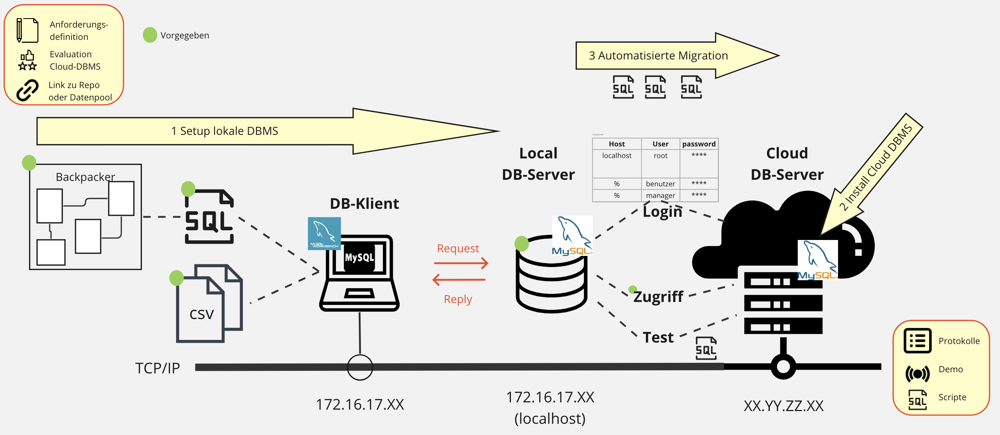

# M141 - DB-Systeme in Betrieb nehmen (8. - 10.Tag)

*Autor der Aufgabenstellung: Kellenberger Michael · TBZ · 2024*

> **Hinweis:** Diese Datei ist die unveränderte TBZ-Original-Aufgabenstellung.
> Die eigentliche Praxisarbeit von Giovanni Merola ist in
> [`README_Praxisarbeit.md`](./README_Praxisarbeit.md) zusammengefasst.

# User Story

Eine kleine Jugendherberge verwaltet ihre Übernachtungen und die Zugänge der Angestellten (Benutzer) in einer kleinen Access-Datenbank. Nun möchte der Betreiber die Datenbank (Backpacker) auf eine schnellere MySQL-Datenbank umstellen.  Er hat die bestehende Struktur in einem SQL-DDL-Skript und die Daten als CSV-Datei abgelegt. Die Struktur und die Daten sind möglicherweise nicht ganz konsistent, was überprüft werden sollte: Nach dem Laden der Datenbasis in ein lokales DBMS soll diese konsolidiert werden (Testen und Optimieren). Für den produktiven Betrieb soll die Datenbasis dann auf einem evaluierten, sicheren Cloud-DBMS laufen, d.h. dorthin migriert werden.

# LB3 Praxisarbeit: Backpacker_LB3 migrieren

**Product Backlog = Kapitel Dokumentation (MS = Meilensteine)** Version 2.1

| MS / Kapitel |  Einträge   (Arbeitspakete)  | Vorgaben  | Kompetenzfeld | Max. Punkte |
|---|---|---|---|:--:|
| **MS A**: Definition | **Definition Infrastruktur**  | - **Anforderungsdefinition**: Ausformulierung der Praxisarbeit gemäss folgender Punkte (SMART)   - **Evaluation** Cloud RDBMS   - **Link zu GitLAB-Repo**  | E1 | 3 + 1 (Abgabe termingerecht)|
| **MS B:** | **Lokale DBMS**  | **Z.B. MariaDB (XAMPP)**  | | |
| 1.1 |  - *ERD 2.NF*  | Gegeben: [Backpacker-Schema](./backpacker_lb3.png), [Backpacker DDL](./backpacker_ddl_lb3.sql) | A1 A2 | |
| 1.2 |  - *Zugriffsmatrix* | Gegeben: Zugriffsmatrix siehe unten | A1 | |
| 1.3 |  - Zugriffs-berechtigungen | - Gemäss Zugriffsmatrix (mind. ein Benutzer pro Gruppenrolle)     - SQL-Scripts (DCL) | D1 C1 | 3 |
| 1.4 |  - DB Daten | - Import [Backpacker CSV-Dateien](./backpacker_lb3.csv.zip)    - SQL-Scripts (DML)   - DB bereinigen (FK, Index, Constraints) | B1 | 6 |
| 1.5 |  - Testen | - Testprotokolle Rollen, Benutzer &rarr; Zugriffsmatrix   - Testprotokolle Datenkonsistenz (Import, Bereinigung)   - SQL-Scripts (Testdaten erstellen für Migration) | C2 | 3 + 1 (Abgabe termingerecht) |
| **MS C:** | **Remote Cloud-DBMS**    | **Z.B. MariaDB (AWS[\*](https://gitlab.com/ch-tbz-it/Stud/m164/-/tree/main/01_Installation_SW/AWSCloud?ref_type=heads))**  | | |
| 2.1 | - Setup Cloud DBMS   | Installation und Setup   | A1 | 3 |
| 2.2 | - Betrieb  | - Cloud DBMS für produktiven Betrieb gesichert <b> - Konfigurationen (my.ini) für prod. Betrieb| A2 C1 | 3  |
| **MS D:** | **Automatisierte Migration**  |  **Lokale DBMS auf Cloud-DBMS migriereren** | | |
| 3.1 |  - Berechtigungen  | - Zugriffsberechtigungen automatisiert übertragen   - SQL-Scripts (DCL) | D1 | 2 |
| 3.2 |  - Migration | - Struktur und Daten automatisiert übertragen   - SQL-Scripts(DDL & DML)  | B1 C1| 2 |
| 3.3 |  - Testen  | - Testprotokolle Rollen, Benutzer &rarr; Zugriffsmatrix   - Testprotokolle Datenkonsistenz (Migration)   - SQL-Scripts (DQL) | C2 | 4|
| **4** | **Protokollierung** | **Meilensteine A-D** termingerecht abgelegt im Repo!   Punkte 1.x - 3.x nachvollziehbar & personalisiert dokumentiert im Repo (*Markdown*, inkl. Prompts) | E1 | 4 + 1 (Abgabe termingerecht) +1 Bonus wenn früher |
| | ***!! Demo !!***  | + Demo 3 User auf Cloud-RDMS vor LP   + Testscript LP (SQL)   + Dauer: 10-15 Min ! | | 4 |
| |   | | | _________ |
|  |   | Max. Punkte: (Note 6)| | 40 |

**Zugriffsmatrix**

|  *DB backpacker\_lb3*     |                |       |       |       |
|---------------------------|----------------|-------|-------|-------|
| *Benutzergruppe:*         | **Benutzer**   |       |       |       |
| Tabellen - Attribute      | S              | I     | U     | D     |  
| tbl\_personen             | **x**          |       | **x** |       |  
| tbl\_benutzer             |                |       |       |       |  
| **-** Passwort            | --             | --    | --    | --    |  
| **-** deaktiviert         | **x**          | --    | --    | --    | 
| **-** restliche Attribute | **x**          | **x** | **x** | --    |  
| tbl\_buchung,   tbl\_positionen | **x**          | **x** | **x** | **x** |   
| tbl\_land,    tbl\_leistung   | **x**          |       |       |       |

|  *DB backpacker\_lb3*     |                |       |       |       |
|---------------------------|----------------|-------|-------|-------|
| *Benutzergruppe:*         | **Management**   |       |       |       |
| Tabellen - Attribute      | S              | I     | U     | D     |  
| tbl\_positionen,   tbl\_buchung             | **x**          |       |       |       |  
| restl. Tabellen           | **x**          | **x** | **x** | **x** |   

*S = Select, I = Insert, U = Update, D = Delete, -- = nicht möglich, - = nicht mehr möglich*

**Rahmenbedingungen**

* **Zeitbudget**: 9-12 Lektionen + Heimarbeit (2 Wo)
* **Meilensteine**: MS A &rarr; Tag 8, MS B &rarr; Tag 9; MS C & D & Demo &rarr; Tag 10
* **Gruppenform**: Partnerarbeit oder Einzelarbeit (*Bonus bei Einzelarbeit*)
* **KI-Einsatz**: Es wird davon ausgegangen, dass KI-Tools eingesetzt werden. Entsperechend sind die Anforderungen (Konsistenzüberprüfung, Testen (positiv-negativ), Optimieren, Sicherheit, Promptqualität)
* **Dokumentation / Protokollierung in Markdown**: Auftragsdefinition, Testprotokolle, Testprotokolle (Lokal/Cloud), Protokollierung der Arbeitspakete, Erläuterungen zu Konfigurationsparameter  
**Zus. Abgabe**: Alle zur Erstellung, Migration und Test benutzten `SQL-Scripts`, *inkl. `KI-Prompts`*, `DB-Dump` (Backup), `my.ini / my.cnf` des prod. DB-Systems
* **Urheberbeweis**: Dokumentieren Sie alle *KI-Prompts*, *personalisieren* Sie die DB-Namen, die Cloud. Screenshots immer mit personalisierten Infos drauf.
* **Bewertung**: Punkteraster gemäss obiger Tabelle   (0% = fehlt/unbrauchbar,   25% = ungenügend/Teil fehlt o. falsch,   50% = genügend/minimal,   75% = gut/erfüllt,   100% = *zusätzliches*)   **Note = P * 4 / Pmax + 2** (Note 1 bei fehlender Abgabe)

