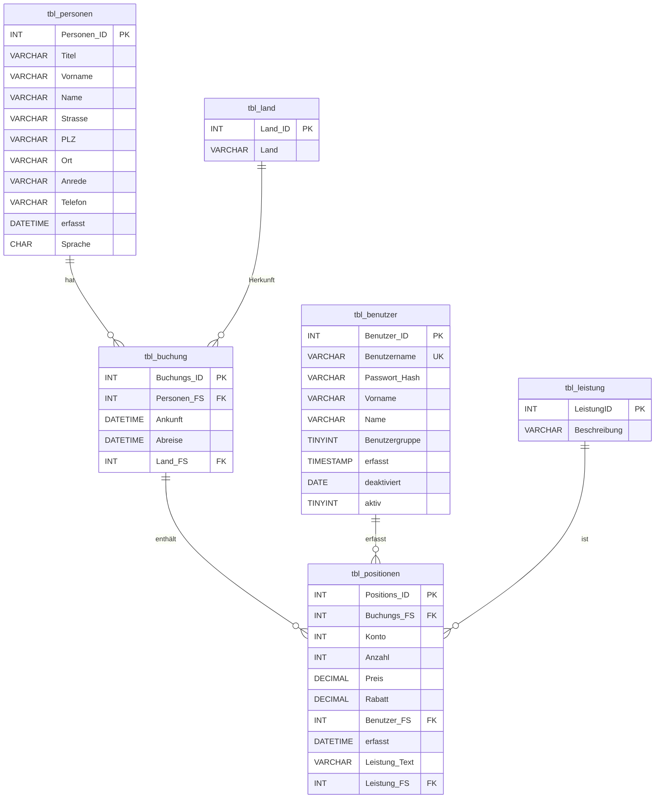

# MS B 1.1 – ERD in 2. Normalform (Backpacker_LB3 – Giovanni Merola)

*Autor: Giovanni Merola · M141 · LB3*

## 1. Ausgangsschema (Bestandsanalyse)

Das gegebene `backpacker_lb3` Schema (siehe `backpacker_ddl_lb3.sql`, `backpacker_lb3.png`) weist folgende Schwächen auf:

| Tabelle | Problem | Normalform-Verstoss |
|---|---|---|
| `tbl_land` | Kein Primärschlüssel deklariert (nur `NOT NULL default '0'`) | 1.NF (Identität nicht gesichert) |
| `tbl_personen` | Fast alle Attribute als `TEXT` (sogar PLZ, Telefon, Anrede) | Effizienz/Domänen-Integrität |
| `tbl_positionen.Leistung_Text` | Redundant zu `tbl_leistung.Beschreibung` über `Leistung_FS`; freier Text kollidiert oft mit Katalog | 2.NF / 3.NF (transitiv abhängig von Leistung_FS) |
| `tbl_positionen.Konto` | Magic-Number ohne FK auf einen Kontenrahmen | 3.NF |
| MyISAM Engine | Keine FK-Unterstützung, kein Transaktions-Rollback | Integrität |
| Keine FK-Constraints zwischen den Tabellen | Verwaiste Referenzen möglich (Beispiel: `Land_FS=0`) | Referenzielle Integrität |
| `Vorname`/`Name`/`Sprache` als `TEXT` | Übergrosse Domäne | Domain-Integrität |
| `deaktiviert` als DATE mit Sentinel `'1000-01-01'` | Kein NULL, fragwürdige Semantik | 1.NF (nicht atomarer Wertebereich) |
| Kein Index auf FK-Spalten | Performance | Implementierung |

## 2. Normalisierungsschritte

### 2.1 → 1.NF
- Eindeutige PKs für alle Tabellen (`tbl_land`, `tbl_leistung`).
- Atomare Werte, keine Mehrfachwerte.
- Sentinel-Datumswerte (`1000-01-01`) durch `NULL` ersetzt.
- Geeignete Datentypen (`VARCHAR(n)`, `CHAR(2)` für Land-Code, `DECIMAL` für Preise).

### 2.2 → 2.NF
Jede Tabelle hat einen einspaltigen Primärschlüssel ⇒ es gibt keine zusammengesetzten Schlüssel, also keine partiellen Abhängigkeiten möglich. Konkret kontrolliert:

- `tbl_positionen`: Alle Attribute (Anzahl, Preis, Rabatt, Konto …) hängen vollständig vom PK `Positions_ID` ab.
- `tbl_buchung`: Alle Attribute hängen von `Buchungs_ID` ab.
- `tbl_personen`: Alle Attribute hängen von `Personen_ID` ab.

→ **2.NF erfüllt.**

### 2.3 Zusätzlich → 3.NF (Bonus-Massnahme)
- Redundanter Freitext `Leistung_Text` wird zugunsten der FK `Leistung_FS` als optionales Beschreibungsfeld behandelt. Wert aus `tbl_leistung.Beschreibung` ist der Master.
- `Benutzergruppe` (Smallint 1=Benutzer, 2=Management) bleibt — wir hängen logisch die Rollen-Definitionen an MariaDB-Roles, nicht an eine zusätzliche Stammtabelle (vereinfacht Migration, Aufgabentext fordert nur 2.NF).

## 3. Neues, normalisiertes ERD (2.NF, InnoDB, FK)

## 4. Schlüssel- und Constraint-Übersicht

| Tabelle | PK | FK (→) | Wichtige Constraints |
|---|---|---|---|
| `tbl_personen` | `Personen_ID` AUTO_INCREMENT | – | `Name NOT NULL`, `Sprache CHAR(2)` |
| `tbl_benutzer` | `Benutzer_ID` AUTO_INCREMENT | – | `UNIQUE(Benutzername)`, `aktiv ∈ {0,1}` |
| `tbl_land` | `Land_ID` | – | `UNIQUE(Land)` |
| `tbl_leistung` | `LeistungID` | – | `UNIQUE(Beschreibung)` |
| `tbl_buchung` | `Buchungs_ID` AUTO_INCREMENT | `Personen_FS → tbl_personen`, `Land_FS → tbl_land` | `CHECK (Abreise >= Ankunft)` |
| `tbl_positionen` | `Positions_ID` AUTO_INCREMENT | `Buchungs_FS → tbl_buchung`, `Benutzer_FS → tbl_benutzer`, `Leistung_FS → tbl_leistung` | `CHECK (Anzahl >= 0)`, `CHECK (Preis >= 0)`, `CHECK (Rabatt BETWEEN 0 AND 100)` |

ON DELETE/UPDATE-Strategie: alle FKs `ON UPDATE CASCADE ON DELETE RESTRICT` (Datenverlust soll explizit erfolgen).

## 5. Indizes

| Tabelle | Index | Begründung |
|---|---|---|
| `tbl_buchung` | `idx_buchung_personen` (Personen_FS) | Häufige Join-Bedingung |
| `tbl_buchung` | `idx_buchung_land` (Land_FS) | Reporting nach Herkunft |
| `tbl_buchung` | `idx_buchung_ankunft` (Ankunft) | Zeitliche Auswertungen |
| `tbl_positionen` | `idx_pos_buchung` (Buchungs_FS) | Aggregation pro Buchung |
| `tbl_positionen` | `idx_pos_benutzer` (Benutzer_FS) | Auswertungen pro Mitarbeitenden |
| `tbl_positionen` | `idx_pos_leistung` (Leistung_FS) | Reporting pro Leistung |
| `tbl_benutzer` | `UNIQUE idx_benutzer_name` (Benutzername) | Login |

## 6. Datentyp-Wechsel (Highlights)

| Original | Neu | Begründung |
|---|---|---|
| `Vorname TEXT` | `VARCHAR(60)` | reicht; nutzt UTF8MB4 |
| `Name TEXT` | `VARCHAR(60) NOT NULL` | reicht; Pflicht |
| `Strasse TEXT` | `VARCHAR(120)` | reicht |
| `PLZ TEXT` | `VARCHAR(10)` | int. PLZ (alphanum.) |
| `Telefon TEXT` | `VARCHAR(30)` | E.164 + Trenner |
| `Sprache TEXT` | `CHAR(2)` | ISO 639-1 |
| `Password text` | `VARCHAR(255)` | Hash + Salt |
| `deaktiviert DATE default '1000-01-01'` | `DATE NULL DEFAULT NULL` | echtes NULL |
| `Land_ID NOT NULL default '0'` | `INT NOT NULL AUTO_INCREMENT` mit PK | PK + Auto |

## 7. Konsequenzen für die Migration

1. Lade CSV in **Staging-Tabellen** mit losen Typen (alles `VARCHAR`) und ohne FKs.
2. Säubere die Stagings (NULL, Trim, FK-Mapping).
3. Übertrage in **Zieltabellen** mit FK-Constraints aktiviert.
4. Drop der Stagings.

---

*Stand: 30.06.2026 – Giovanni Merola*
